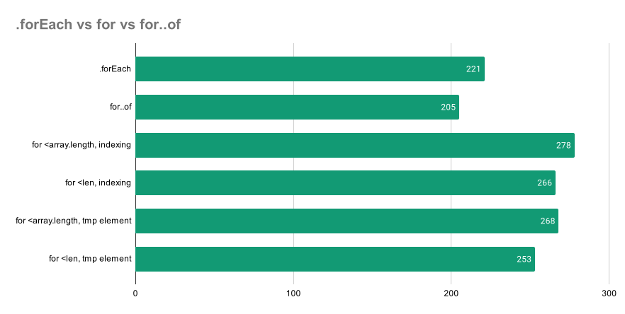
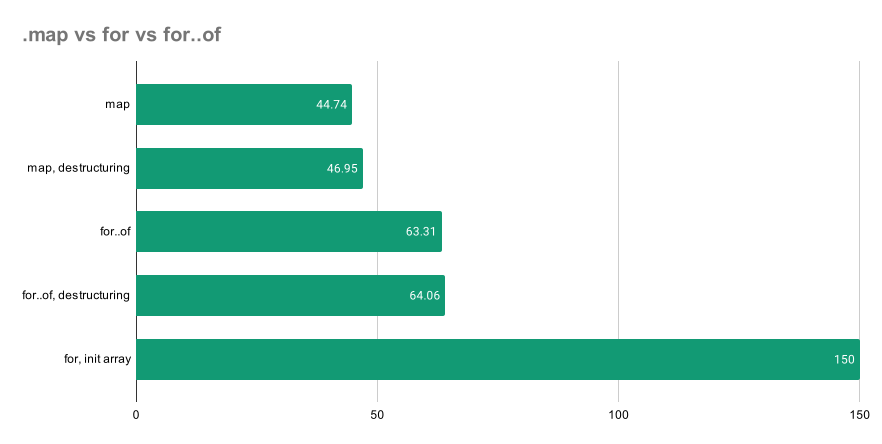
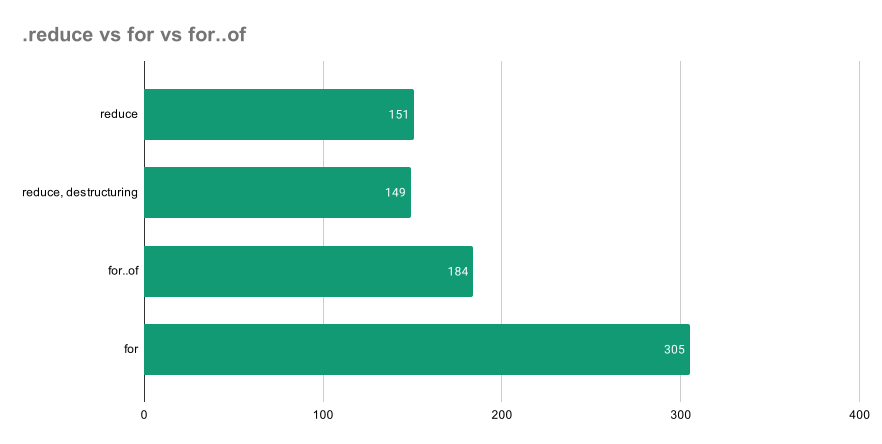

# Performance benchmarks for different array iteration methods.

The goal is to show that imperative programming using ``for`` and ``for...of`` is 3+ times faster than declarative alternatives.

In most cases, when dealing with small arrays, this doesn't matter and won't affect the whole application's performance in any way. However, when processing large amounts of data in some kind of business intelligence app, video processing, scientific calculations, or game engine, this will have a massive effect on the overall performance.

Running the tests locally: 
```bash
npm i
npm start
```


## Results on i5-8250, 16Gb RAM running Ubuntu 20.04 LTS with Node v14.16.0





```
Benchmarking forEach:
Array.forEach x 61.49 ops/sec ±0.20% (64 runs sampled)
for of x 171 ops/sec ±0.42% (86 runs sampled)
for <array.length, indexing x 164 ops/sec ±0.70% (82 runs sampled)
for <len, indexing x 168 ops/sec ±0.49% (84 runs sampled)
for <array.length, tmp element x 167 ops/sec ±0.53% (84 runs sampled)
for <len, tmp element x 163 ops/sec ±1.07% (81 runs sampled)
for of is faster

Benchmarking map:
Array.map x 33.38 ops/sec ±2.73% (58 runs sampled)
Array.map, destructuring x 33.23 ops/sec ±1.75% (59 runs sampled)
for of x 42.87 ops/sec ±8.90% (51 runs sampled)
for of, destructuring x 39.84 ops/sec ±10.84% (55 runs sampled)
for, init array x 67.91 ops/sec ±1.76% (70 runs sampled)
for, init array is faster

Benchmarking reduce:
Array.reduce x 49.59 ops/sec ±1.16% (64 runs sampled)
Array.reduce, destructuring x 49.09 ops/sec ±1.11% (64 runs sampled)
for of x 183 ops/sec ±0.54% (71 runs sampled)
for x 190 ops/sec ±0.61% (85 runs sampled)
for is faster
```

## Conculsions
* ``.forEach``, ``.reduce``, ``.map`` are much slower than their direct imperative implementations. Callback function costs matter here.
* ``for`` and ``for..of`` have roughly the same performance for arrays
* There's no point in trying to micro-optimize the for loop for arrays. V8 already does a great job.
* Destructuring doesn't affect the performance.
* It's faster to pre-allocate the array with a known length than to rely on push automatic growth.

---

Read more on [our blog](https://leanylabs.com/blog/js-forEach-map-reduce-vs-for-for_of/).
